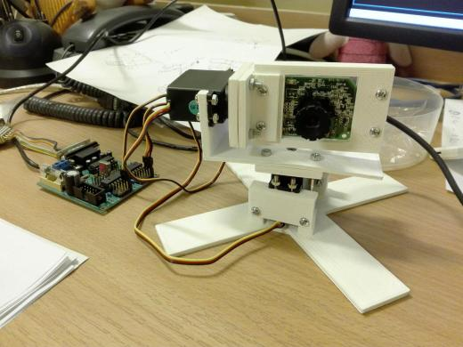

# hello human

small hackaton to show ppl what programming is... in real life. :)
it's more about end effect that code (quality) itself.

project is about making a 3d-printed box for usb-cam, that tracks faces it sees.

project is a mixture of Python and OpenSCAD code.
